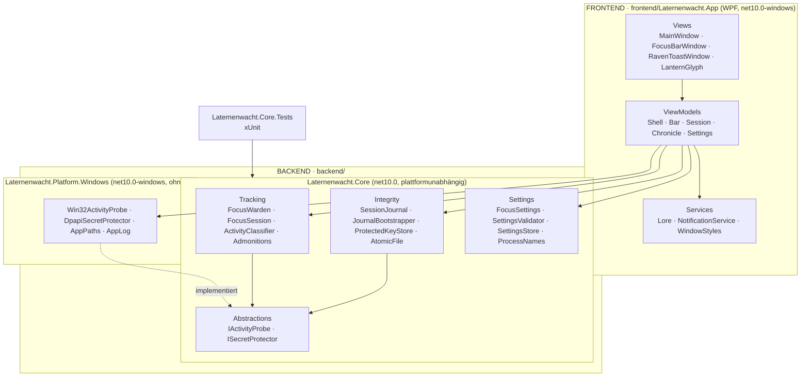
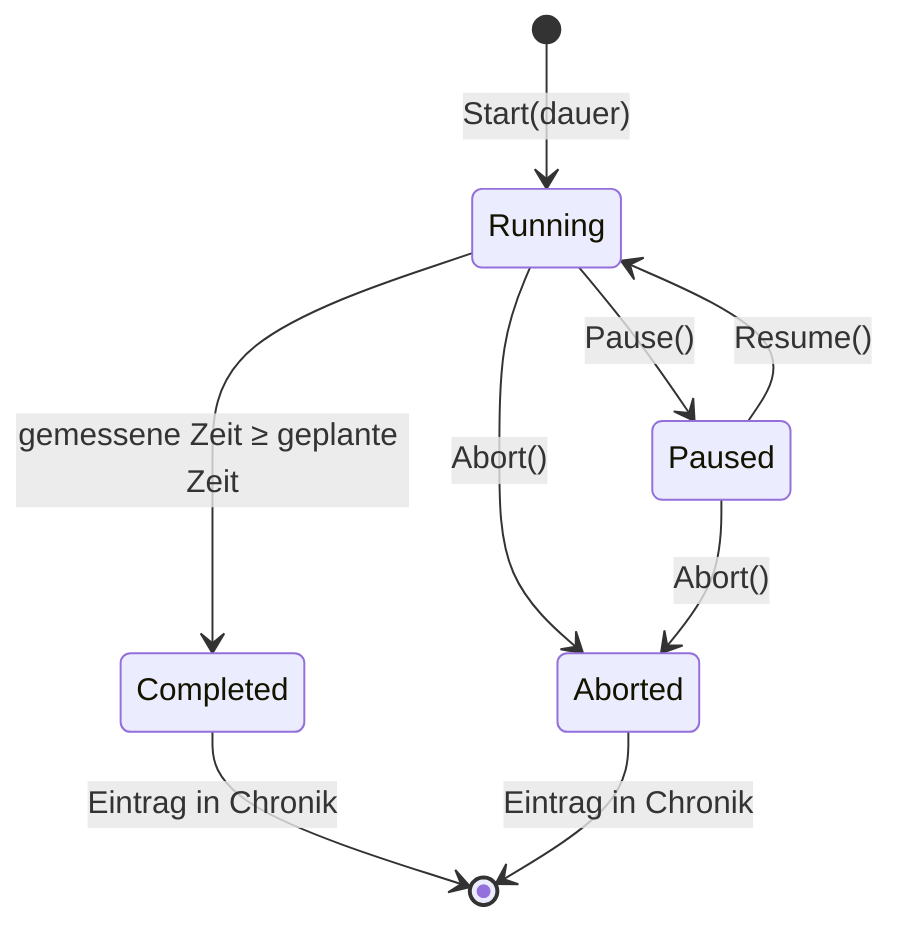
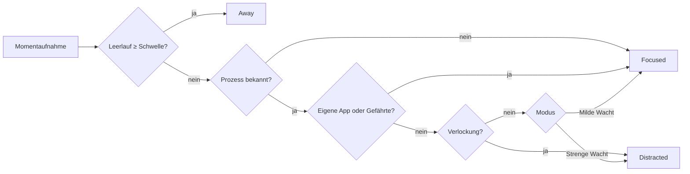
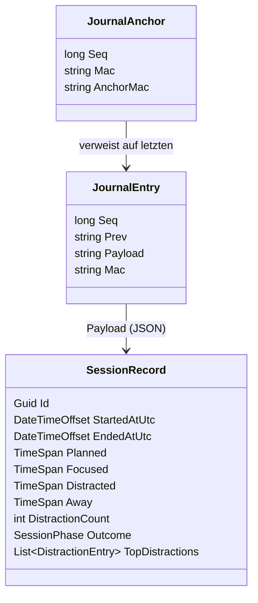
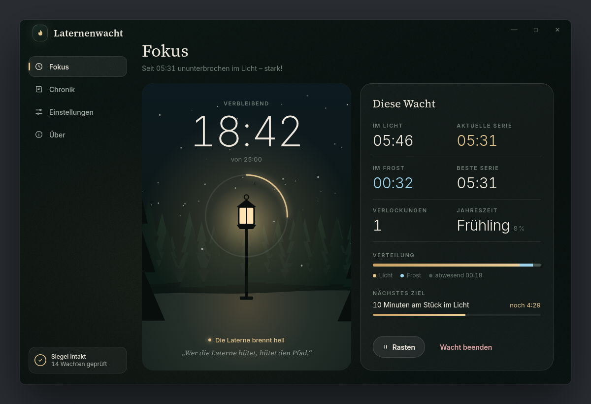
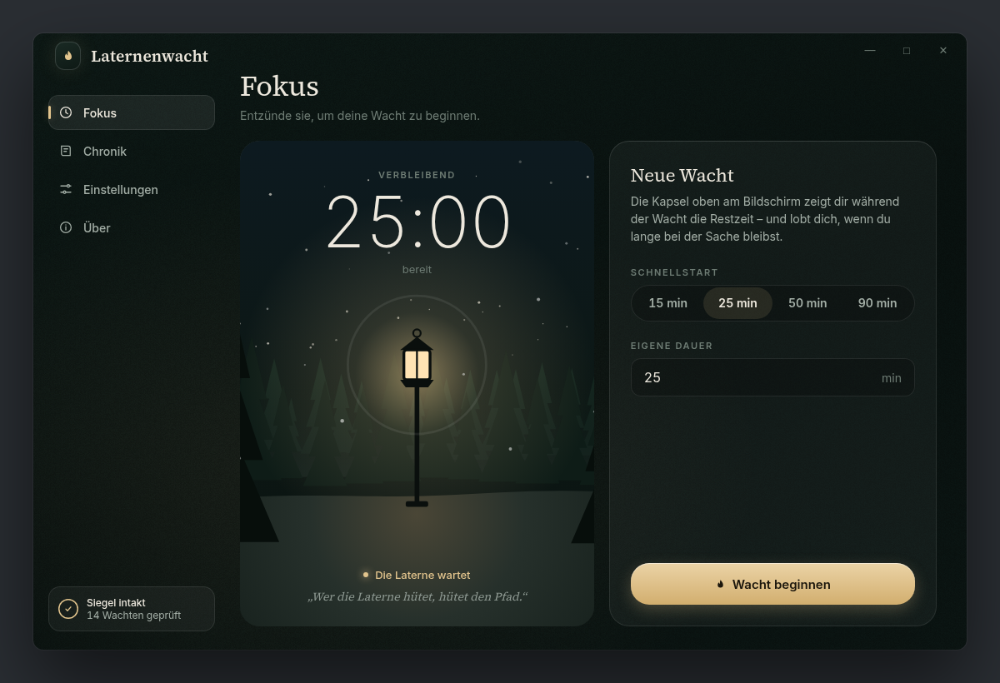
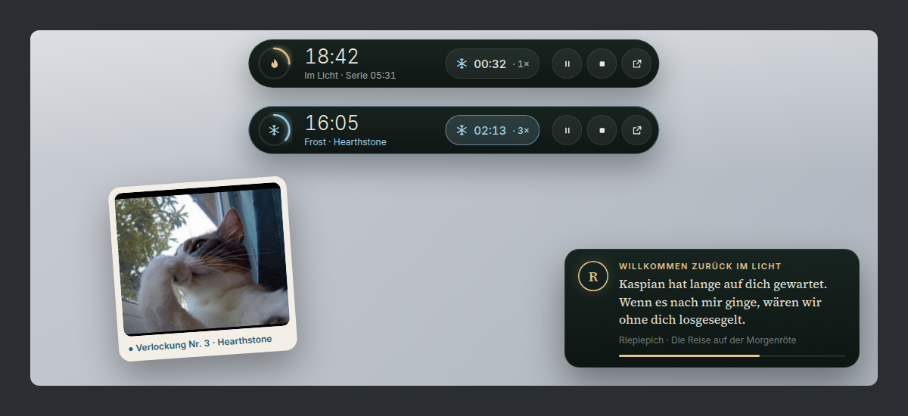
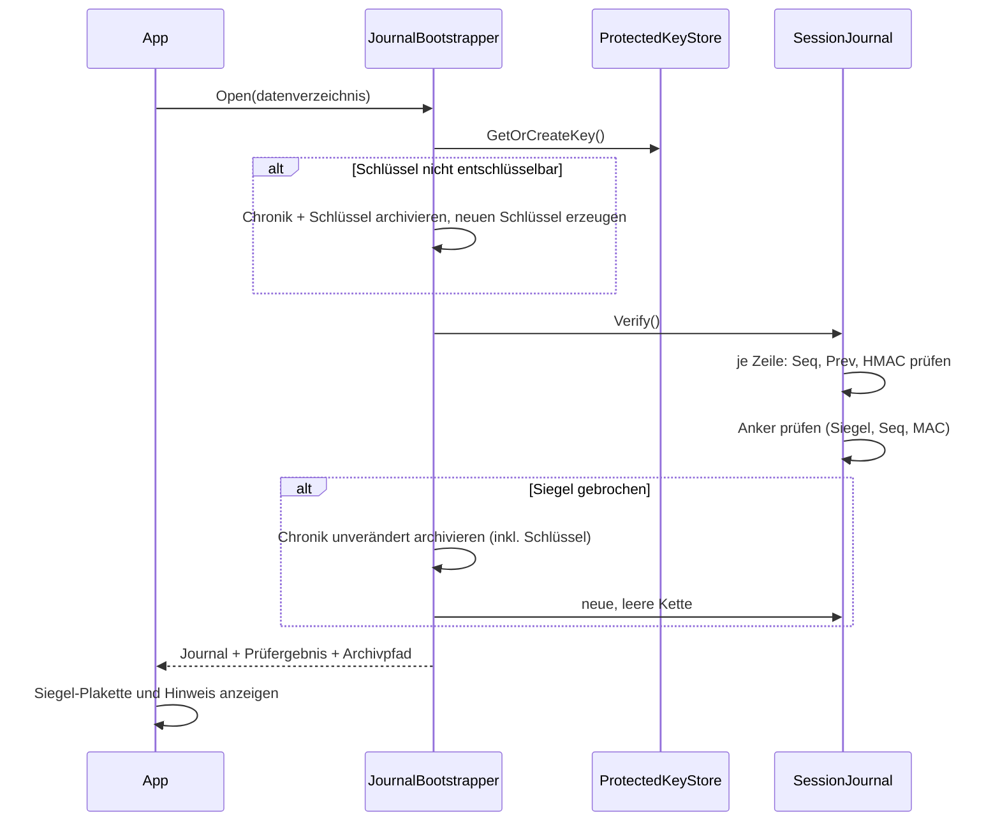

# Projektdokumentation – „Laternenwacht“

**Ein Fokuswächter mit manipulationsgeschützter Sitzungschronik**

| | |
|---|---|
| Ausbildungsberuf | Fachinformatiker/-in für Anwendungsentwicklung |
| Projekt | Laternenwacht – Desktopanwendung zur Messung von Ablenkung während Fokuszeiten |
| Technologie | C# 14, .NET 10, WPF, xUnit |
| Repository | `yourworstdream/succesy` |
| Stand | Oktober 2026, Version 1.2.0 |

---

## Inhaltsverzeichnis

1. [Einleitung](#1-einleitung)
2. [Projektplanung](#2-projektplanung)
3. [Analysephase](#3-analysephase)
4. [Entwurfsphase](#4-entwurfsphase)
5. [Sicherheits- und Integritätskonzept](#5-sicherheits--und-integritätskonzept)
6. [Implementierungsphase](#6-implementierungsphase)
7. [Qualitätssicherung](#7-qualitätssicherung)
8. [Abnahme und Einführung](#8-abnahme-und-einführung)
9. [Fazit und Ausblick](#9-fazit-und-ausblick)
10. [Anhang](#10-anhang)

---

## 1. Einleitung

### 1.1 Projektumfeld

Konzentriertes Arbeiten in festen Zeitblöcken („Fokuszeiten“, etwa nach der Pomodoro‑Technik) ist
in Ausbildung, Studium und Softwareentwicklung verbreitet. Gängige Timer zählen jedoch nur die
*geplante* Zeit herunter. Wie viel dieser Zeit tatsächlich durch Ablenkungen (Messenger, Spiele,
Streaming) verloren geht, bleibt unsichtbar.

### 1.2 Projektziel

Es wird eine Windows‑Desktopanwendung entwickelt, die

* während einer Fokuszeit **am oberen Bildschirmrand dauerhaft anzeigt, wie lange sich der Benutzer
  bereits ablenkt** („Frost“),
* abgeschlossene Sitzungen in einer **manipulationserkennenden Chronik** speichert (Integrität),
* dabei **Datenschutz und Sicherheit** konsequent berücksichtigt (keine Fenstertitel, keine
  Netzwerkkommunikation, keine erhöhten Rechte),
* und durch eine **Fantasy‑Gestaltung** – angelehnt an die Atmosphäre der Chroniken von C. S. Lewis
  (Laternenpfahl im Schneewald, ewiger Winter, wiederkehrender Frühling) – motiviert statt zu tadeln.

### 1.3 Projektbegründung

Sichtbarkeit verändert Verhalten: Eine laufend sichtbare Ablenkungszeit wirkt als unmittelbares
Feedback. Die Gamification über Jahreszeiten und humorvolle „Mahnrufe“ senkt die Hemmschwelle,
das Werkzeug dauerhaft zu nutzen. Die versiegelte Chronik schafft eine verlässliche Datengrundlage,
etwa für Lerntagebücher oder Selbstreflexion in der Ausbildung.

### 1.4 Projektabgrenzung

Nicht Bestandteil des Projekts sind:

* Blockieren von Programmen oder Webseiten (die Anwendung beobachtet, sie bevormundet nicht),
* Auswertung einzelner Browser‑Tabs (dafür wären Fenstertitel nötig – bewusst ausgeschlossen),
* Synchronisation zwischen Geräten, Mehrbenutzerbetrieb, Lokalisierung in weitere Sprachen.

---

## 2. Projektplanung

### 2.1 Projektphasen und Zeitplanung

| Phase | Tätigkeiten | Soll (h) |
|---|---|---:|
| Analyse | Ist‑Analyse, Anforderungen, Wirtschaftlichkeit | 6 |
| Entwurf | Architektur, Zustandsautomat, Datenmodell, Sicherheitskonzept, UI‑Konzept | 12 |
| Implementierung | Kernlogik, Integritätsjournal, Win32‑Anbindung, WPF‑Oberfläche | 34 |
| Qualitätssicherung | Unit‑Tests, manuelle Tests, Code‑Review, statische Analyse | 12 |
| Dokumentation | Projektdokumentation, Benutzer‑ und Veröffentlichungsanleitung | 8 |
| **Summe** | | **72** |

### 2.2 Ressourcen

* **Hardware:** Arbeitsplatzrechner mit Windows 11.
* **Software:** Visual Studio 2026, .NET 10 SDK, Git/GitHub, GitHub Actions (CI).
* **Bibliotheken:** ausschließlich .NET‑Bordmittel; für Tests xUnit. Bewusst **keine** weiteren
  Laufzeitabhängigkeiten (kleinere Angriffsfläche, keine Lizenz‑ oder Lieferkettenrisiken).

### 2.3 Entwicklungsprozess

Iterativ‑inkrementelles Vorgehen: Zuerst die plattformunabhängige, testgetriebene Fachlogik
(`Laternenwacht.Core`), anschließend die Windows‑Oberfläche. Jede Iteration endet mit grünem Build
(Warnungen werden als Fehler behandelt) und grünen Tests in der CI.

---

## 3. Analysephase

### 3.1 Ist‑Analyse

Bisher wurden einfache Timer‑Apps genutzt. Ablenkungen wurden – wenn überhaupt – nachträglich
geschätzt. Schätzungen sind erfahrungsgemäß stark geschönt; eine objektive Messung fehlte.

### 3.2 Wirtschaftlichkeitsbetrachtung (vereinfacht)

Angenommen, ein Auszubildender verliert täglich 30 Minuten Fokuszeit unbemerkt. Reduziert die
Sichtbarkeit diesen Verlust nur um ein Drittel, ergeben sich bei 220 Arbeitstagen
**≈ 55 Stunden** gewonnene Arbeitszeit pro Jahr und Person. Dem stehen einmalig 72 Stunden
Entwicklungsaufwand gegenüber; ab etwa zwei Nutzern amortisiert sich das Projekt im ersten Jahr.
Lizenzkosten entstehen nicht.

### 3.3 Anforderungen

**Funktionale Anforderungen**

| Nr. | Anforderung | Priorität |
|---|---|---|
| F1 | Fokussitzung („Wacht“) mit wählbarer Dauer (1–480 min, Schnellwahl 15/25/50/90) starten | Muss |
| F2 | Stets sichtbare Leiste am **oberen Bildschirmrand** mit Restzeit und **kumulierter Ablenkungszeit** | Muss |
| F3 | Erkennung von Ablenkung anhand des Vordergrundprogramms (Erlaubnis‑ oder Sperrliste) | Muss |
| F4 | Erkennung von Abwesenheit über Leerlaufzeit, getrennt ausgewiesen | Muss |
| F5 | Pausieren, Fortsetzen, Abbrechen einer Wacht | Muss |
| F6 | Speicherung abgeschlossener Wachten in einer Chronik mit Integritätsprüfung | Muss |
| F7 | Anzeige des Siegelzustands (unversehrt / gebrochen) | Muss |
| F8 | Konfigurierbare Listen, Dauer, Leerlaufschwelle mit Eingabevalidierung | Muss |
| F9 | Humorvolle Mahnrufe bei Erreichen von Ablenkungsschwellen | Soll |
| F10 | Statistik: Gesamtfokus, Gesamtfrost, Frühlingsquote | Soll |
| F11 | Mahnrufe als **Push‑Benachrichtigung** („Rabenbote“), abschaltbar | Soll |
| F12 | Fokusleiste **frei verschiebbar**, Position wird gespeichert; Rückkehr an den oberen Rand | Soll |
| F13 | **Rechtsklick‑Menü** der Leiste: Auswahl, aus welchem der sieben Bücher der Chroniken die Mahnrufe stammen (oder gemischt) | Soll |
| F15 | **Positive Verstärkung:** Lob für Fokus‑Serien (10/25/45/60/90 min), „Willkommen zurück“ nach einer Ablenkung, Würdigung makelloser Wachten und neuer Bestleistungen; getrennt von den Mahnrufen abschaltbar | Soll |
| F14 | Bei jeder neuen Ablenkung **treibt ein Meme** in einem Pop‑up quer über den Bildschirm; eigene Memes hinzufügbar, abschaltbar | Kann |

**Nichtfunktionale Anforderungen**

| Nr. | Anforderung |
|---|---|
| N1 | **Datenschutz:** nur Prozessname und Leerlaufzeit; keine Fenstertitel, Inhalte, Tastatureingaben (Datensparsamkeit, Art. 5 DSGVO) |
| N2 | **Sicherheit:** keine Administratorrechte, keine Netzwerkzugriffe, keine Fremdbibliotheken zur Laufzeit |
| N3 | **Integrität:** Veränderung, Löschung, Vertauschung oder Abschneiden von Chronikeinträgen wird erkannt |
| N4 | **Robustheit:** beschädigte Dateien führen nie zum Absturz |
| N5 | **Messgenauigkeit:** Verstellen der Systemuhr beeinflusst die Messung nicht |
| N6 | **Ergonomie:** Leiste stiehlt keinen Fokus, ist DPI‑fest, per Tastatur/Screenreader bedienbar |
| N7 | **Wartbarkeit:** Schichtenarchitektur, MVVM, automatisierte Tests für die gesamte Fachlogik |
| N8 | **Auslieferung:** eine einzelne, eigenständige EXE |

---

## 4. Entwurfsphase

### 4.1 Architektur

Die Lösung folgt einer Schichtenarchitektur mit strikter Abhängigkeitsrichtung
(Oberfläche → Fachlogik; niemals umgekehrt). Plattformspezifisches ist hinter Schnittstellen
verborgen (*Dependency Inversion*), wodurch die Fachlogik ohne Windows testbar ist.



**Begründete Technologieentscheidungen**

| Entscheidung | Alternativen | Begründung |
|---|---|---|
| WPF | WinUI 3, WinForms, Electron | Reif, transparente randlose Fenster, Vektorgrafik/Animation, keine Zusatzlaufzeit, in VS 2026 voll unterstützt |
| Eigenes MVVM‑Minimum | CommunityToolkit.Mvvm | Keine Laufzeitabhängigkeit (N2); Umfang gering |
| `TimeProvider` (.NET) | `DateTime.Now`, `Stopwatch` direkt | Monotone Zeit (N5) **und** testbar durch eigene Uhr |
| JSON Lines + HMAC‑Kette | SQLite, Klartext‑JSON | Anhängen ohne Umschreiben, zeilenweise prüfbar, keine Datenbankabhängigkeit |
| Quellgenerierte JSON‑Serialisierung | Reflection‑basiert | Keine Reflection, kein Polymorphismus, unbekannte Felder werden abgelehnt |

### 4.2 Zustandsautomat einer Wacht



Innerhalb von `Running` wechselt der **Aktivitätszustand** bei jeder Messung (1 Hz):

| Zustand | Bedingung | Darstellung |
|---|---|---|
| `Focused` | erlaubtes/neutrales Programm, Benutzer aktiv | Laterne brennt, goldener Rahmen |
| `Distracted` | Verlockung (Sperrliste) bzw. Nicht‑Gefährte (strenger Modus) | Frost kriecht über die Leiste |
| `Away` | Leerlauf ≥ Schwelle **oder** Messlücke > 30 s (Standby) | „Die Laterne wacht allein“ |

**Verbuchungsregel:** Die Zeit zwischen zwei Messungen wird dem *zuvor* gemessenen Zustand
zugerechnet und auf die Restzeit begrenzt. So endet eine Wacht exakt nach der geplanten Dauer,
und `Fokus + Frost + Abwesenheit = gemessene Zeit` gilt stets (Invariante, per Test abgesichert).

### 4.3 Klassifikation



Unbekannte Vordergrundfenster (Sperrbildschirm, Zugriff verweigert) werden bewusst **nicht**
bestraft – eine Fehlmessung soll nie zu Lasten des Benutzers gehen.

### 4.4 Datenmodell



Ablage unter `%LOCALAPPDATA%\Laternenwacht\`:

| Datei | Inhalt |
|---|---|
| `einstellungen.json` | Einstellungen (eingerücktes JSON, menschenlesbar) |
| `chronik.jsonl` | Eine versiegelte Zeile je Wacht |
| `chronik.anker.json` | Versiegelter Verweis auf den letzten Eintrag |
| `siegel.key` | 256‑Bit‑HMAC‑Schlüssel, DPAPI‑verschlüsselt |
| `archiv\gebrochen-<Zeit>\` | Unverändert archivierte, gebrochene Chronik (Beweissicherung) |
| `laternenwacht.log` | Technisches Fehlerprotokoll (ohne Aktivitätsdaten, max. 1 MB) |

### 4.5 Oberflächenkonzept

**Gestaltungsleitbild:** „Das Reich hinter dem Schrank“ – eine Winternacht mit einem einzelnen
Laternenpfahl. Die Metaphern sind durchgängig und selbsterklärend:

| Fachbegriff | Im Reich |
|---|---|
| Fokussitzung | **Wacht** |
| Ablenkungszeit | **Frost** |
| Erlaubte Programme | **Gefährten** (in den Einstellungen: „Arbeitsprogramme“) |
| Ablenkende Programme | **Verlockungen** (in den Einstellungen: „Ablenkungen“) |
| Sitzungshistorie | **Chronik** |
| Integritätsprüfung | **Siegel** |
| Ergebnisbewertung | **Jahreszeit**: Frühling (< 10 % Frost), Tauwetter (< 25 %), Winter |
| Hinweis bei vielen Ablenkungen | **Mahnruf** (z. B. bei 20 Verlockungen: *„Herrscher von Cair Paravel, Ihr gefährdet Euer Königreich mit Eurem Müßiggang!“*) |

**Gestaltungssystem „Nachtwald“ (ab Version 1.5).** Die Oberfläche hat zwei Iterationen durchlaufen,
die beide im Nutzertest scheiterten – ein lehrreicher Teil des Projekts:

1. *Fantasy‑klassisch* (Nachtblau, Gold, Pergament, Serifen, Ornamente): wirkte altmodisch und „generiert“.
2. *„Schneelicht“* (Cremeweiß, Tinte, Orange, schlichte weiße Karten): wirkte beliebig – Cremeweiß mit Orange
   ist zudem die Markenfarbwelt eines bekannten KI‑Assistenten, die App sah dadurch „nach KI“ aus.

Die dritte Fassung leitet Farbe und Form konsequent aus dem Motiv ab – **ein Laternenlicht in einem
verschneiten Wald bei Nacht** – statt aus einem Baukasten:

| Rolle | Farbe | Verwendung |
|---|---|---|
| Nacht | `#08100E`–`#0D1915` | Fensterhintergrund: Tannen‑Schwarzgrün statt Schwarz oder Navy, mit warmem Lichtschimmer und feinem Korn |
| Glas | 4–7 % Weiß, Kante 9–14 % | Flächen mit feiner Lichtkante statt flacher Karten |
| Ivory · Sage · Moss | `#EDE8DD` · `#A3AEA6` · `#6E7C74` | Text in drei Stufen, leicht grünstichig passend zum Wald |
| **Kerzenlicht** | `#E2C48D` | einziger warmer Akzent: Fokus, Fortschritt, Lob – mit sanftem Lichtschein |
| **Frost** | `#9FD3EA` | ausschließlich Ablenkung – kaltes Licht |

* **Illustration statt Kasten:** Im Zentrum der Fokus‑Seite steht eine Szene (Sternenhimmel, drei Ebenen
  Tannen, verschneiter Boden, Laternenpfahl). Der Fortschritt läuft als **Lichtring um die Laterne**;
  bei Ablenkung wird das Licht kalt und eisblau. Fallender Schnee und ein leicht atmender Lichtschein
  geben Leben – beides entfällt, wenn Windows „Animationen anzeigen“ ausgeschaltet ist.
  Die Tannenreihen sind per Skript generiert (unregelmäßig wie echte Waldkanten) und als Vektorpfade eingebettet.
* **Eigene Fensterleiste** (`WindowChrome`) statt der weißen Standard‑Titelleiste; Größenänderung,
  Andocken und Maximieren bleiben erhalten.
* **Typografie:** Überschriften in *Sitka* (moderne Serifenschrift, Bestandteil von Windows), Zahlen in
  *Segoe UI Variable Display* im leichten Schnitt (groß, ruhig, tabellarisch), Fließtext in *Segoe UI Variable Text*.
* **Details:** leuchtende Marke am aktiven Navigationseintrag, Schalter und Hauptschaltfläche in Champagner,
  dunkle Auswahllisten, Kontextmenüs und Tooltips, schmale Bildlaufleisten.
* **Positiv gestaltet:** Die rechte Spalte zeigt neben Kennzahlen und Verteilung ein **„Nächstes Ziel“**
  (z. B. „25 Minuten am Stück im Licht – noch 4:29“).
* **Barrierefreiheit:** sichtbarer Tastaturfokus (Kerzenlicht‑Rahmen), `AutomationProperties.Name` an
  Steuerelementen, reduzierte Bewegung respektiert, Kontrast Ivory auf Nacht > 14 : 1.



*Abb.: Fokus‑Seite während einer Wacht (Entwurfsvorschau als HTML‑Nachbau). Mitte: Szene mit Lichtring
und Restzeit; rechts: Kennzahlen, Verteilung und nächstes Ziel.*



*Abb.: Fokus‑Seite vor dem Start mit Schnellstart und eigener Dauer.*



*Abb.: Fokusleiste aus dunklem Waldglas – oben im Fokus, darunter abgelenkt (eisblauer Schimmer).
Rechts eine Botschaft mit Initial‑Avatar und Serifen‑Zitat, links ein treibendes Meme.*

**Fokusleiste (Kapsel)**

* Kapsel aus dunklem Waldglas, damit sie auf hellen wie dunklen Hintergründen trägt.
  Lichtring = Fortschritt der Wacht, große Zahl = Restzeit, Unterzeile = Kurzstatus
  („Im Licht · Serie 12:30“ bzw. „Frost · Hearthstone“), Chip = Frostzeit und Anzahl der Ablenkungen.
* **Verschiebbar:** Ziehen mit der linken Maustaste; die Position wird gespeichert. Fehlt der Bildschirm
  später (z. B. Laptop ohne Zweitmonitor), sitzt sie wieder oben mittig. Rechtsklick ▸
  *Leiste zurück an den oberen Rand* setzt sie zurück.
* **Rechtsklick‑Menü:** Programm im Vordergrund als Ablenkung markieren, Buch der Chroniken wählen
  (Band 1–7 oder gemischt), Lob/Mahnrufe/Memes schalten, Wacht steuern.
* `WS_EX_NOACTIVATE`: Klicks stehlen **nicht** den Tastaturfokus – sonst würde die Leiste selbst
  die Messung verfälschen. `WS_EX_TOOLWINDOW`: kein Eintrag in Alt+Tab/Taskleiste.
* Bei Ablenkung wechseln Ring, Rand und Chip von Kerzenlicht zu Eisblau, die Kapsel schimmert kalt und die Flamme wird zur Schneeflocke.

---

## 5. Sicherheits- und Integritätskonzept

### 5.1 Schutzziele und Bedrohungsmodell

| Schutzziel | Bedrohung (STRIDE) | Beispiel |
|---|---|---|
| Integrität | **T**ampering | Benutzer schönt Frostzeiten in `chronik.jsonl` |
| Integrität | **R**epudiation | Einzelne schlechte Wachten werden gelöscht |
| Vertraulichkeit | **I**nformation Disclosure | Fremde lesen Aktivitätsdaten mit |
| Verfügbarkeit | **D**enial of Service | Beschädigte/riesige Dateien bringen die App zum Absturz |
| Rechte | **E**levation of Privilege | Anwendung fordert unnötig Adminrechte |

**Angreifermodell:** Der typische „Angreifer“ ist der Benutzer selbst oder ein Mitbenutzer, der
Dateien mit einem Texteditor verändert. Ein lokaler Administrator mit Debugger ist ausdrücklich
**nicht** im Schutzumfang (siehe 5.4).

### 5.2 Maßnahmen

| # | Maßnahme | Umsetzung | Wirkt gegen |
|---|---|---|---|
| M1 | **HMAC‑SHA256‑Siegel** je Eintrag über `Seq`, `Prev` und exakten Payload‑Text | `SessionJournal.ComputeEntryMac` | Veränderung |
| M2 | **Hash‑Kette** (`Prev` = Siegel des Vorgängers) und fortlaufende `Seq` | `SessionJournal.VerifyCore` | Löschen, Einfügen, Vertauschen |
| M3 | **Versiegelter Anker** auf den letzten Eintrag | `chronik.anker.json` | Abschneiden am Ende, Löschen der ganzen Chronik |
| M4 | **Domänentrennung** der MAC‑Eingaben (`entry\n…`, `anchor\n…`) | Präfixe | Verwechslung von Anker‑ und Eintragssiegeln |
| M5 | **Konstantzeit‑Vergleich** der Siegel | `CryptographicOperations.FixedTimeEquals` | Timing‑Seitenkanäle |
| M6 | **Schlüsselschutz mit DPAPI** (CurrentUser + anwendungsspezifische Entropie) | `DpapiSecretProtector` | Auslesen/Kopieren des Schlüssels durch andere Konten |
| M7 | **Kryptografisch zufälliger 256‑Bit‑Schlüssel** | `RandomNumberGenerator` | Erraten |
| M8 | **Beweissicherung statt Überschreiben**: gebrochene Chronik wird unverändert archiviert, danach neue Kette | `JournalBootstrapper` | Vertuschung, Datenverlust |
| M9 | **Atomares Schreiben** (Temp‑Datei + Umbenennen, `Flush(true)`) | `AtomicFile` | Halbe Dateien bei Absturz/Stromausfall |
| M10 | **Absturztoleranz des Ankers** (hinkt er genau einen gültig versiegelten Eintrag hinterher, wird er nachgezogen) | `VerifyCore` | Fehlalarm nach Absturz |
| M11 | **Strikte Eingabevalidierung**: Whitelist‑Regex für Prozessnamen, Wertebereiche, Listenlängen | `ProcessNames`, `SettingsValidator` | Pfad‑/Steuerzeicheninjektion, unsinnige Werte |
| M12 | **Sichere Deserialisierung**: quellgeneriert, kein Polymorphismus, `UnmappedMemberHandling.Disallow`, `required`‑Felder | `CoreJsonContext` | Deserialisierungsangriffe, untergeschobene Felder |
| M13 | **Größenlimits** (Einstellungen 256 KB, Zeile 16 KB, Chronik 20 MB, Anker 4 KB) | Store/Journal | Speicher‑DoS |
| M14 | **Monotone Zeitmessung** (`TimeProvider.GetTimestamp`) | `FocusSession` | Uhrmanipulation |
| M15 | **Least Privilege**: `asInvoker`, keine Hooks, nur lesende Win32‑Abfragen | `app.manifest`, `NativeMethods` | Rechteausweitung |
| M16 | **DLL‑Suchpfad auf System32 beschränkt** | `DefaultDllImportSearchPaths` | DLL‑Hijacking |
| M17 | **Datensparsamkeit**: keine Fenstertitel, keine Eingaben, Protokoll ohne Aktivitätsdaten | `Win32ActivityProbe`, `AppLog` | Offenlegung privater Inhalte |
| M18 | **Keine Netzwerkzugriffe, keine Laufzeit‑Fremdpakete** | Architektur | Datenabfluss, Lieferkettenangriffe |
| M19 | **Einzelinstanz** über benannten Mutex | `App.OnStartup` | Konkurrierende Schreibzugriffe |
| M20 | **Statische Analyse** (`AnalysisLevel latest-recommended`, Warnungen = Fehler) | `Directory.Build.props` | Fehlerklassen wie fehlendes Dispose, unsichere APIs |

### 5.3 Ablauf der Integritätsprüfung beim Start



### 5.4 Grenzen (kritische Reflexion)

* Der Schlüssel gehört dem Benutzerkonto. Wer als **derselbe Benutzer** gezielt Code ausführt
  (z. B. ein eigenes Programm, das DPAPI aufruft), kann gültige Siegel erzeugen. Ein vollständiger
  Schutz wäre nur mit einer vertrauenswürdigen Drittpartei (Server‑Zeitstempel, TPM‑Attestierung)
  möglich – außerhalb des Projektumfangs und im Widerspruch zu N2 (keine Netzwerkzugriffe).
* **Rollback** auf eine vollständige ältere Kopie (Chronik *und* Anker) ist nicht erkennbar.
* Die Klassifikation basiert auf Prozessnamen; eine Ablenkung *innerhalb* eines erlaubten
  Programms (z. B. Videoportal im Browser) wird im milden Modus nicht erkannt – bewusst zugunsten
  des Datenschutzes (N1).

Die Chronik ist damit **manipulationserkennend** („tamper‑evident“), nicht **manipulationssicher**
(„tamper‑proof“). Für den Einsatzzweck – ehrliche Selbstbeobachtung – ist das angemessen.

---

## 6. Implementierungsphase

### 6.1 Projektstruktur

```
Succesy/
├── Laternenwacht.sln                Gesamtlösung (Backend + Frontend)
├── global.json                      SDK-Festlegung (.NET 10)
├── backend/                         BACKEND – eigenständig baubar und übergebbar
│   ├── Laternenwacht.Backend.sln
│   ├── GEMINI.md                    Arbeitsanweisung/Vertrag für KI-Assistenten
│   ├── Directory.Build.props        Qualitätsregeln (vom Frontend importiert)
│   ├── Directory.Packages.props     Zentrale Paketversionen
│   ├── src/
│   │   ├── Laternenwacht.Core/              Fachlogik (plattformunabhängig)
│   │   │   ├── Abstractions/   IActivityProbe, ISecretProtector
│   │   │   ├── Integrity/      SessionJournal, JournalBootstrapper, ProtectedKeyStore, AtomicFile
│   │   │   ├── Model/          SessionRecord, ActivityState, SessionPhase, ChronicleBook …
│   │   │   ├── Settings/       FocusSettings, SettingsValidator, SettingsStore, ProcessNames
│   │   │   └── Tracking/       FocusWarden, FocusSession, ActivityClassifier, Admonitions …
│   │   └── Laternenwacht.Platform.Windows/  Win32-Messung, DPAPI, Pfade, Protokoll (ohne UI)
│   └── tests/Laternenwacht.Core.Tests/
├── frontend/                        FRONTEND – nur Darstellung
│   ├── Directory.Build.props        importiert die Regeln des Backends
│   └── Laternenwacht.App/           WPF-Anwendung
│       ├── Assets/                  Anwendungssymbol
│       ├── Properties/PublishProfiles/   Veröffentlichungsprofil (einzelne EXE)
│       ├── Services/                Erzähltexte (Lore), Rabenbote, Fensterstile
│       ├── Themes/Realm.xaml        Gestaltungssystem
│       ├── ViewModels/              MVVM
│       └── Views/                   Hauptfenster, Fokusleiste, Laterne, Rabenbote
├── docs/                            Diese Dokumentation, Veröffentlichungsanleitung
└── .github/workflows/build.yml      CI: Build, Test, EXE-Artefakt
```

**Trennung von Frontend und Backend:** Das Backend kennt das Frontend nicht und lässt sich ohne
den Rest des Repositorys bauen und testen (`backend/Laternenwacht.Backend.sln`). Das Frontend
referenziert ausschließlich die beiden Backend-Projekte. Die öffentliche Schnittstelle, die das
Frontend nutzt, ist in `backend/GEMINI.md` (Abschnitt „Vertrag mit dem Frontend“) festgehalten;
dadurch kann das Backend an andere Entwickler oder KI-Assistenten übergeben werden, ohne dass
versehentlich das Frontend bricht.

### 6.2 Ausgewählte Implementierungsdetails

**Zeitverbuchung ohne Drift** (`FocusSession.Accumulate`): Statt pro Tick pauschal „+1 s“ zu
zählen, wird die tatsächlich vergangene monotone Zeit gemessen. Verzögerte Timer‑Ticks (z. B. bei
hoher Last) führen so nicht zu Ungenauigkeiten; Messlücken > 30 s (Standby) werden als
Abwesenheit gewertet.

```csharp
var delta = _time.GetElapsedTime(_lastTimestamp, now);
var credited = delta < remaining ? delta : remaining;          // nie über die geplante Dauer
var state = delta > MaxTickGap ? ActivityState.Away : CurrentState;
```

**Versiegeln eines Eintrags** (`SessionJournal.Append`): Der Payload wird *einmal* serialisiert und
als exakter Text gespeichert. Dadurch ist die Prüfung byte‑genau reproduzierbar, unabhängig von
künftigen Änderungen an Serialisierungsoptionen.

```csharp
var payload = JsonSerializer.Serialize(record, CoreJsonContext.Default.SessionRecord);
var entry = new JournalEntry(seq, _lastMac, payload, ComputeEntryMac(seq, _lastMac, payload));
```

**Mahnrufe** (`Admonitions.Next`): Schwellen nach Anzahl der Verlockungen (3, 5, 10, 15, **20**, 30, 50)
und nach Frostminuten (5, 10, 20, 45). Jeder Spruch erscheint höchstens einmal je Wacht;
übersprungene Schwellen werden nicht nachgereicht, damit keine Spruchkaskade entsteht.
Jedes der sieben Bücher besitzt einen eigenen Satz von elf Sprüchen (eine je Schwelle). Im Modus
„Alle Chroniken“ wählt ein je Wacht zufälliger Startwert für jede Schwelle ein anderes Buch.

**Rabenbote** (`RavenToastWindow`, `NotificationService`): Eigene Push‑Benachrichtigung statt
Windows‑Toast. Begründung: Windows‑Toasts erfordern für nicht paketierte Anwendungen eine
registrierte App‑ID mit Startmenü‑Verknüpfung (zusätzliche Installationsschritte und
Registry‑Schreibzugriffe), außerdem passt die Darstellung nicht zur Gestaltung. Der Rabenbote
aktiviert sich nie (`WS_EX_NOACTIVATE`), verschwindet nach 10 s, pausiert bei Mausberührung und
ersetzt eine noch sichtbare ältere Botschaft.

**Positive Verstärkung** (Backend: `FocusSession.CurrentStreak/LongestStreak`, `FocusWarden.ReturnedToWork`,
`FocusWarden.FocusStreakReached`, `Homecomings`, `Praises`): Die App erkennt nicht nur Ablenkung,
sondern vor allem, was gut läuft. Eine Fokus‑Serie wächst nur im Fokus und wird ausschließlich durch
eine Ablenkung zurückgesetzt – kurze Abwesenheit (Nachdenken, Telefonat) bestraft also nicht. Lob kommt
leise (ohne Ton) und mit grünem Siegel, damit es die Konzentration nicht selbst unterbricht; je Serie
wird jede Schwelle nur einmal gewürdigt. Die längste Serie wird als optionales Feld `LongestFocusStreak`
in der Chronik gespeichert – bestehende Einträge bleiben gültig versiegelt, weil das Siegel über den
gespeicherten Text gebildet wird.

**Schwimmende Memes** (`MemeService`, `MemeFloatWindow`, Backend: `FocusWarden.DistractionStarted`,
`ShuffleBag<T>`, `MemeCatalog`): Das Backend meldet jede *neue* Ablenkungs‑Episode genau einmal.
Das Frontend wählt per „Wundertüte“ ein Meme (nie dasselbe zweimal hintereinander) und lässt ein
kleines, nicht aktivierendes Fenster zeitbasiert über den Arbeitsbereich treiben (Sinuswelle +
leichtes Schaukeln). Bewusst kein bildschirmgroßes transparentes Fenster – das wäre bei hohen
Auflösungen teuer. Es treibt höchstens ein Meme gleichzeitig, damit schnelles Hin‑ und Herwechseln
den Bildschirm nicht flutet. Eigene Bilder werden defensiv eingelesen (nur Bildendungen, oberste
Ordnerebene, keine Verknüpfungen, max. 10 MB, max. 200 Dateien) und mit begrenzter Auflösung
dekodiert; unlesbare Dateien werden übersprungen und protokolliert. Eingebaute Memes wurden
verkleinert und ohne Metadaten (EXIF, ggf. GPS) gespeichert.

**Sofort wirkende Einstellungen** (`SettingsViewModel.ApplyQuickChange`): Buchwahl, Benachrichtigungen
und Leistenposition werden ohne „Speichern“ übernommen – ungespeicherte Eingaben im Formular
bleiben dabei unberührt.

**Fokusleiste ohne Fokusraub** (`WindowStyles.MakeNonActivatingToolWindow`): Erweiterte Fensterstile
`WS_EX_NOACTIVATE | WS_EX_TOOLWINDOW` werden nach Erzeugung des nativen Fensters gesetzt.

---

## 7. Qualitätssicherung

### 7.1 Automatisierte Tests

135 Unit‑Tests (xUnit) für die Fachlogik, u. a.:

| Testklasse | Geprüft wird |
|---|---|
| `FocusSessionTests` | Verbuchung auf Vorzustand, Episodenzählung, exaktes Ende, Pausen, Standby‑Lücken, **Uhrmanipulation**, Abbruch |
| `ActivityClassifierTests` | Beide Modi, Groß‑/Kleinschreibung, `.exe`, Leerlauf, unbekannter Vordergrund |
| `FocusWardenTests` | Ereignis „Wacht beendet“ genau einmal, keine Doppelstarts, Einstellungen wirken sofort |
| `SessionJournalTests` | **Veränderung, Löschung, Vertauschung, Abschneiden, gefälschter Anker, falscher Schlüssel, Müllzeilen**, Absturz‑Reparatur |
| `JournalBootstrapperTests` | Erststart, Schlüssel nie im Klartext, Archivierung gebrochener Chroniken, defekter Schlüssel |
| `SettingsTests` | Wertebereiche, Überschneidungen, Normalisierung, **verdächtige Namen** (Pfade, Nullbytes), Round‑Trip, **beschädigte Dateien** |
| `HomecomingTests`, `PraiseTests` | Abwesenheitsstufen, Riepiepich‑Gruß, vollständige Spruchsätze je Buch und Schwelle |
| `KnownDistractionTests` | Hearthstone & Co. ab Werk erkannt, Gefährten haben Vorrang, Katalog abschaltbar, Markieren ohne Duplikate |
| `ShuffleBagTests` | Jedes Element einmal je Durchgang, nie zweimal hintereinander, Sonderfälle leer/einzeln |
| `MemeCatalogTests` | Nur Bildendungen, sortiert, leere Dateien und Unterordner ignoriert, Anzahlgrenze |
| `AdmonitionTests` | Schwellen, Einmaligkeit, kein Nachreichen, **Cair‑Paravel‑Mahnruf bei 20**, vollständige und eindeutige Spruchsätze je Buch, gewähltes Buch wird genutzt, gemischter Modus |
| `FormattingTests` | Zeitformat, Jahreszeiten‑Grenzen |

Zeitabhängige Tests laufen mit einer **manuell vorgestellten Uhr** (`ManualTimeProvider`) und sind
damit deterministisch und schnell (< 1 s gesamt).

### 7.2 Statische Analyse und CI

* `TreatWarningsAsErrors`, `Nullable enable`, `AnalysisLevel latest-recommended`, Code‑Stil im Build.
* GitHub Actions (`windows-latest`): Restore → Build (Release) → Test → Publish → EXE als Artefakt.

### 7.3 Manueller Testplan (Auszug)

| Nr. | Schritt | Erwartung |
|---|---|---|
| T1 | Wacht mit 1 min starten, nur in Visual Studio arbeiten | Leiste gold, Frost 00:00, nach 1 min „Der Frühling ist gekommen!“ |
| T2 | Während der Wacht Discord in den Vordergrund holen | Rahmen eisblau, Frost zählt hoch, Detail „Eine Verlockung ruft: discord“ |
| T3 | Buch „Der König von Narnia“ wählen, 20‑mal zwischen Editor und Verlockung wechseln | Rabenbote unten rechts: „Herrscher von Cair Paravel …“ |
| T4 | Auf die Leiste klicken | Vorheriges Fenster behält den Tastaturfokus |
| T5 | 2 min keine Eingabe | „Die Laterne wacht allein“, Zeit unter „abwesend“ |
| T6 | Systemuhr während der Wacht um 1 h verstellen | Restzeit unverändert |
| T7 | `chronik.jsonl` im Editor ändern, App neu starten | Plakette „Das Siegel ist gebrochen!“, Archivhinweis, neue Chronik |
| T8 | Zweite Instanz starten | Hinweis „Die Laternenwacht brennt bereits“ |
| T9 | Ungültigen Namen `C:\x.exe` als Verlockung speichern | Fehlermeldung, nichts gespeichert |
| T10 | Anzeige mit 150 % / 200 % Skalierung | Leiste und Symbole scharf, oben zentriert |
| T11 | Leiste mit der Maus verschieben, App neu starten | Leiste erscheint an der neuen Stelle, alle Ecken rund |
| T12 | Rechtsklick ▸ *Leiste zurück an den oberen Rand* | Leiste dockt oben zentriert an |
| T13 | Rechtsklick ▸ *Sprüche aus dem Buch* ▸ *Der silberne Sessel* | Häkchen wandert, nächster Mahnruf stammt aus diesem Buch |
| T14 | Benachrichtigungen per Rechtsklick abschalten, Schwelle erreichen | Kein Rabenbote; Mahnruf nur im Hauptfenster |
| T15 | Auf den Rabenboten klicken, während in einem Editor getippt wird | Botschaft verschwindet, Editor behält den Fokus |
| T16 | Während der Wacht zu einer Verlockung wechseln | Ein Meme treibt schaukelnd über den Bildschirm, Beschriftung „Verlockung Nr. 1: …“ |
| T17 | Auf das treibende Meme klicken | Es versinkt; das aktive Programm behält den Fokus |
| T21 | 11 Minuten ohne Ablenkung arbeiten | Leise grüne Botschaft „10 Minuten am Stück im Licht“, Leiste: „Seit 11:00 ununterbrochen im Licht – stark!“ |
| T22 | 15 Minuten in Hearthstone, dann zurück in den Editor (Buch: *Die Reise auf der Morgenröte*) | „Willkommen zurück im Licht“ – „Kaspian hat lange auf dich gewartet …“ — Riepiepich; treibendes Meme versinkt |
| T23 | Wacht ohne eine einzige Ablenkung vollenden | Würdigung „Makellose Wacht“, ggf. „Neue Bestleistung“ |
| T19 | Wacht starten, Hearthstone in den Vordergrund holen | Frost zählt hoch, „Eine Verlockung ruft: Hearthstone“ |
| T20 | Unbekanntes Spiel im Vordergrund, Rechtsklick auf die Leiste ▸ *„… als Verlockung markieren“* | Ab sofort Frost; Eintrag erscheint in der Liste der Verlockungen |
| T18 | *Memes hinzufügen …*, eine PNG‑ und eine TXT‑Datei wählen | PNG wird übernommen, TXT übersprungen und gemeldet |

---

## 8. Abnahme und Einführung

Die Auslieferung erfolgt als **einzelne, eigenständige EXE** (keine Installation, keine .NET‑Laufzeit
auf dem Zielsystem nötig). Die Schritte in Visual Studio 2026 beschreibt
[`Veroeffentlichung-VS2026.md`](Veroeffentlichung-VS2026.md). Einstellungen und Chronik liegen im
Benutzerprofil; eine Deinstallation besteht aus dem Löschen der EXE und des Ordners
`%LOCALAPPDATA%\Laternenwacht`.

Frontend und Backend werden dabei über Projektverweise zu einer Anwendung verbunden und gemeinsam
in die EXE gepackt. Für die Auslieferung stehen drei Wege bereit: das Skript `Veroeffentlichen.cmd`
(Tests + Veröffentlichung per Doppelklick), das Veröffentlichungsprofil in Visual Studio und – für die
Weitergabe an andere – ein GitHub‑Release, das ein Versions‑Tag (`v1.2.0`) automatisch mit EXE und
SHA‑256‑Prüfsumme erzeugt.

---

## 9. Fazit und Ausblick

### 9.1 Soll‑Ist‑Vergleich

Alle Muss‑ und Soll‑Anforderungen (F1–F13, N1–N8) wurden umgesetzt. Die Fachlogik ist vollständig
von der Oberfläche entkoppelt und automatisiert getestet.

### 9.2 Lessons Learned

* Monotone Zeitquellen und eine injizierbare Uhr (`TimeProvider`) machen Zeitlogik sowohl korrekt
  als auch testbar – ein früher Architekturentscheid, der sich mehrfach bezahlt machte.
* Integrität braucht mehr als eine Prüfsumme: Erst Kette **und** Anker decken alle Manipulationsarten ab.
* Eine konsequente Metaphernwelt ersetzt Erklärtexte – die Bedienung wird intuitiv.

### 9.3 Ausblick

* Signierte Releases und automatische Updates (z. B. über MSIX/WinGet).
* Optionaler externer Zeitstempeldienst (RFC 3161) für stärkere Integrität.
* Wochen‑ und Monatsauswertung als Diagramm; Export (CSV/PDF) für Lerntagebücher.
* Andocken an den oberen Rand eines beliebigen Bildschirms (derzeit Hauptbildschirm; frei verschoben
  funktioniert die Leiste bereits auf allen Bildschirmen).
* Optional echte Windows‑Benachrichtigungen (Info‑Center) bei MSIX‑Paketierung.

---

## 10. Anhang

* **A1** Benutzer‑Kurzanleitung: siehe [`README.md`](../README.md)
* **A2** Veröffentlichung: [`Veroeffentlichung-VS2026.md`](Veroeffentlichung-VS2026.md)
* **A3** Quellcode: Backend `backend/src/`, Tests `backend/tests/`, Frontend `frontend/`
* **A4** Übergabe‑Anweisung für das Backend: [`backend/GEMINI.md`](../backend/GEMINI.md)

> **Hinweis zur Gestaltung:** Die Laternenwacht ist eine nicht‑kommerzielle Hommage an die
> Atmosphäre der Chroniken von C. S. Lewis. Sie steht in keiner Verbindung zu den Rechteinhabern;
> alle Texte sind eigene Formulierungen.
