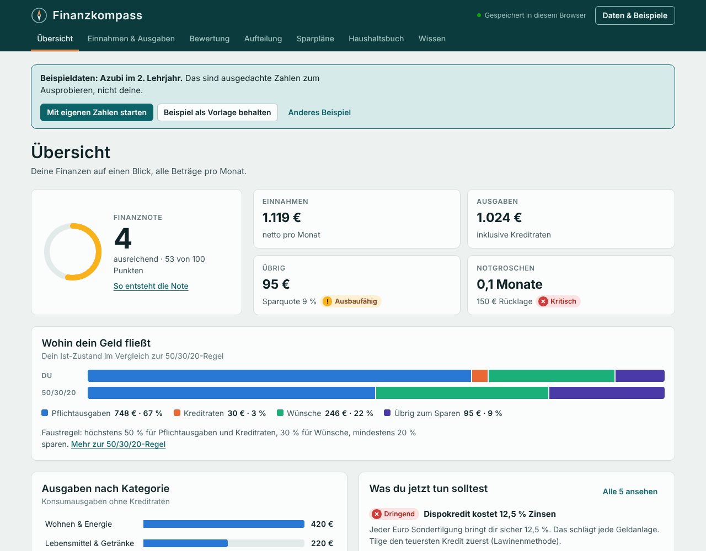
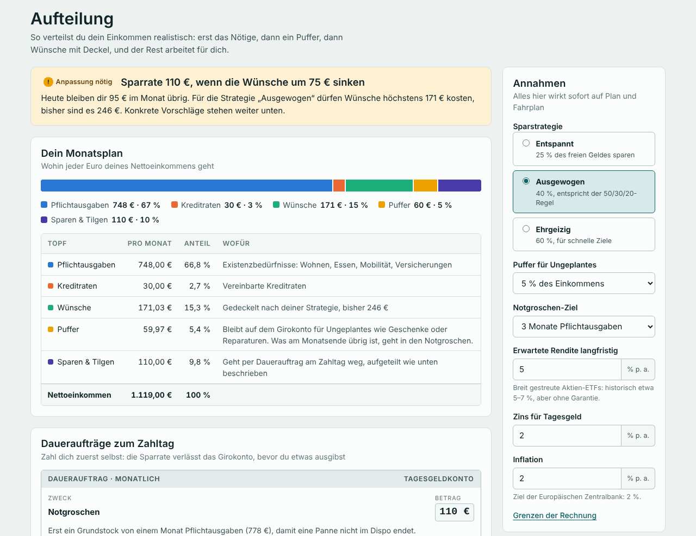
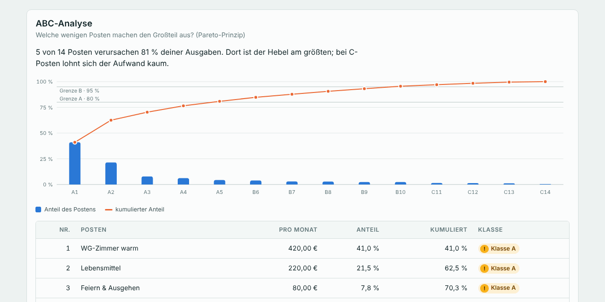

# Finanzkompass

Eine Web-App für die eigenen Finanzen: Sie **stellt Einnahmen und Ausgaben übersichtlich dar**,
**bewertet jede Ausgabe mit Methoden aus Volks- und Betriebswirtschaft**, **teilt das Geld realistisch
auf** und **erstellt Sparpläne** mit Fahrplan bis zum Ziel. Alles läuft im Browser, ohne Server,
ohne Anmeldung und ohne Abhängigkeiten.



## Starten

* **Doppelklick auf `index.html`** – fertig. Es wird nichts installiert und nichts aus dem Internet geladen.
* Oder als kleiner Webserver: `python -m http.server` im Ordner `finanzkompass/`, dann `http://localhost:8000` öffnen.

Beim ersten Start ist ein Beispielhaushalt geladen (Azubi im 2. Lehrjahr). Über **Daten & Beispiele**
gibt es zwei weitere (Berufseinsteiger, Familie), mit **Mit eigenen Zahlen starten** beginnt man leer.

## Was die App kann

| Bereich | Inhalt |
|---|---|
| **Übersicht** | Finanznote nach IHK-Notenschlüssel, Einnahmen, Ausgaben, Überschuss, Notgroschen, Geldfluss im Vergleich zur 50/30/20-Regel, Ausgaben nach Kategorie, die drei wichtigsten nächsten Schritte |
| **Einnahmen & Ausgaben** | Regelmäßige Posten mit Intervall (wöchentlich bis jährlich), Kategorie, Bedürfnisart, fix/variabel und Nutzungen pro Monat; Kredite mit Restlaufzeit und Zinskosten; Rücklagen |
| **Bewertung** | Sechs Kennzahlen mit Ampel, 50/30/20-Regel, Bedürfnisarten, ABC-Analyse mit Pareto-Diagramm, Vergleich mit dem Durchschnittshaushalt, Opportunitätskosten, Kosten pro Nutzung, ein Urteil mit Begründung für jede Ausgabe, Empfehlungen |
| **Aufteilung** | Monatsplan für jeden Euro, Daueraufträge zum Zahltag, konkrete Kürzungsvorschläge, Fahrplan mit Phasen und Meilensteinen, Vermögensentwicklung nominal und real |
| **Sparpläne** | Je Ziel: nötige Rate, Rate im Plan, voraussichtliches Datum, passende Anlageform mit magischem Dreieck; Sparplan-Rechner mit Dynamik, Inflation und Umkehrrechnung |
| **Haushaltsbuch** | Buchungen erfassen, Fixposten mit einem Klick übernehmen, Soll-Ist-Vergleich je Kategorie, Verlauf der letzten zwölf Monate |
| **Wissen** | Alle verwendeten ökonomischen Grundlagen kurz erklärt; jede Bewertung verlinkt dorthin |



## Ökonomische Grundlagen

**Bewertung der Ausgaben**

* **Bedürfnisarten** – Existenz-, Kultur- und Luxusbedürfnisse; Existenzbedürfnisse sind der „Bedarf“ der 50/30/20-Regel.
* **Ökonomisches Prinzip** – Minimalprinzip für Verträge (gleicher Nutzen, weniger Geld), Maximalprinzip für variable Großposten.
* **Kennzahlen** – Sparquote, Notgroschen-Reichweite, Pflichtausgaben-Anteil, Fixkostenquote, Wohnkostenquote
  (Überlastung ab 40 % nach Eurostat), Schuldendienstquote. Bei kleinem Einkommen gelten nach dem
  Engel-Gesetz mildere Grenzen.
* **ABC-Analyse / Pareto-Prinzip** – A-Posten (bis 80 % der Summe) zeigen, wo Sparen am meisten bringt.
* **Durchschnittshaushalt** – Anteile an den Konsumausgaben laut Statistischem Bundesamt
  (Laufende Wirtschaftsrechnungen 2024), mit Hinweis auf Engel- und Schwabe-Gesetz.
* **Opportunitätskosten** – was jede verzichtbare Ausgabe in 10, 20 und 30 Jahren angelegt wert wäre.
* **Grenznutzen** – Kosten pro Nutzung bei Abos und Mitgliedschaften (erstes Gossensches Gesetz).

**Realistische Aufteilung**

1. Pflichtausgaben und Kreditraten zuerst.
2. Ein Puffer für Ungeplantes (Standard 5 % des Einkommens) bleibt auf dem Girokonto.
3. Vom freien Rest wird nach Strategie gespart: entspannt 25 %, ausgewogen 40 % (entspricht bei 50 %
   Pflichtausgaben genau 50/30/20), ehrgeizig 60 %. Wer schon weniger für Wünsche ausgibt, spart den Rest;
   wer mehr ausgibt, bekommt konkrete Kürzungen (Luxus zuerst halbieren, Kultur höchstens um ein Viertel).
4. Die Sparrate fließt nach der **Finanzpyramide**: Notgroschen-Grundstock (ein Monat Pflichtausgaben),
   teure Kredite ab 8 % mit der **Lawinenmethode**, Notgroschen auffüllen parallel zu Sparzielen nach
   Priorität, Kredite über der erwarteten Rendite, dann Vermögensaufbau.
5. Der Fahrplan wird **Monat für Monat simuliert** – mit Zinsen, Kreditraten und frei werdenden Raten,
   die in die Sparrate fließen (Schneeball-Effekt).

**Sparpläne**

* Zinseszins mit konformem Monatszins, Dynamik, Inflation (Kaufkraft heute), 72er-Regel.
* Anlageform nach Laufzeit und **magischem Dreieck** (Sicherheit, Verfügbarkeit, Rendite):
  bis 3 Jahre Tagesgeld, bis 10 Jahre Mischung, darüber ETF.



## Aufbau

```
finanzkompass/
  index.html             Seitengerüst und Wissensteil
  assets/logik.js        Rechenkern: Analyse, Bewertung, Aufteilung, Simulation, Zinsrechnung (ohne Oberfläche)
  assets/beispiele.js    Drei Beispielhaushalte
  assets/diagramme.js    SVG-Diagramme mit Tooltip für Maus und Tastatur
  assets/app.js          Oberfläche: Ansichten, Formulare, Speichern, Import/Export
  assets/style.css       Gestaltung, helles und dunkles Farbschema
  tests/logik.test.js    Tests für den Rechenkern
```

`logik.js` und `beispiele.js` laufen im Browser und in Node. Die Oberfläche rechnet nichts selbst.

## Tests

```bash
node --test finanzkompass/tests/logik.test.js
```

Die Tests laufen automatisch in GitHub Actions (`.github/workflows/finanzkompass.yml`), sobald sich etwas
in `finanzkompass/` ändert.

## Datenschutz und Sicherheit

* Alle Daten bleiben im `localStorage` des Browsers. Es gibt keine Netzwerkzugriffe, keine Schriften
  oder Skripte von fremden Servern.
* Sichern und Wiederherstellen über **Daten & Beispiele** (JSON-Datei oder Zwischenablage).
* Importierte Daten werden vollständig geprüft und bereinigt; alle Texte werden beim Anzeigen maskiert.

## Grenzen

Der Finanzkompass ist ein Lern- und Planungswerkzeug, keine Anlage-, Steuer- oder Schuldnerberatung.
Renditen sind Annahmen, Steuern (Abgeltungsteuer über dem Sparerpauschbetrag) sind nicht eingerechnet,
und der Fahrplan geht von gleichbleibendem Einkommen und gleichbleibenden Ausgaben aus.
